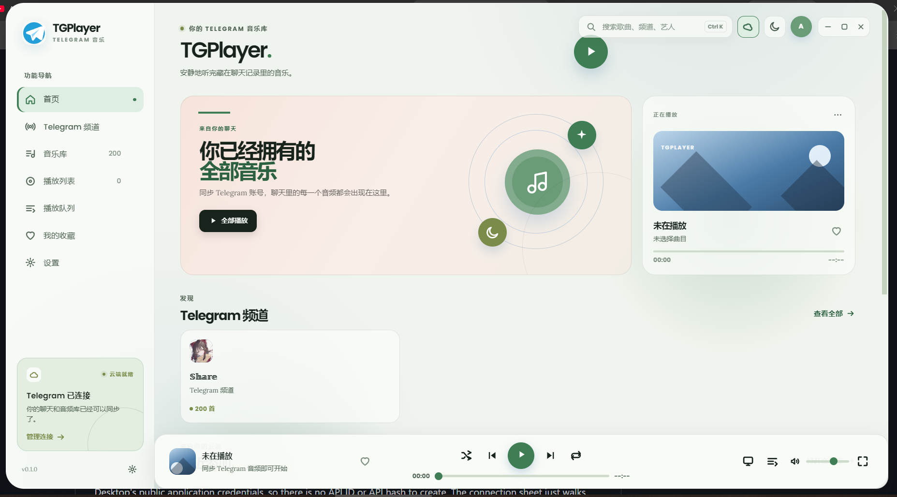
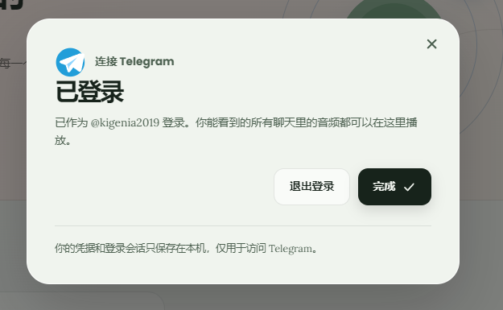
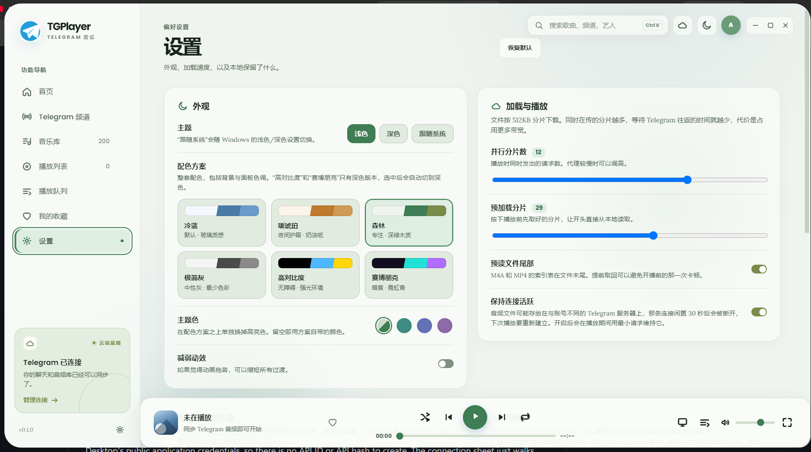
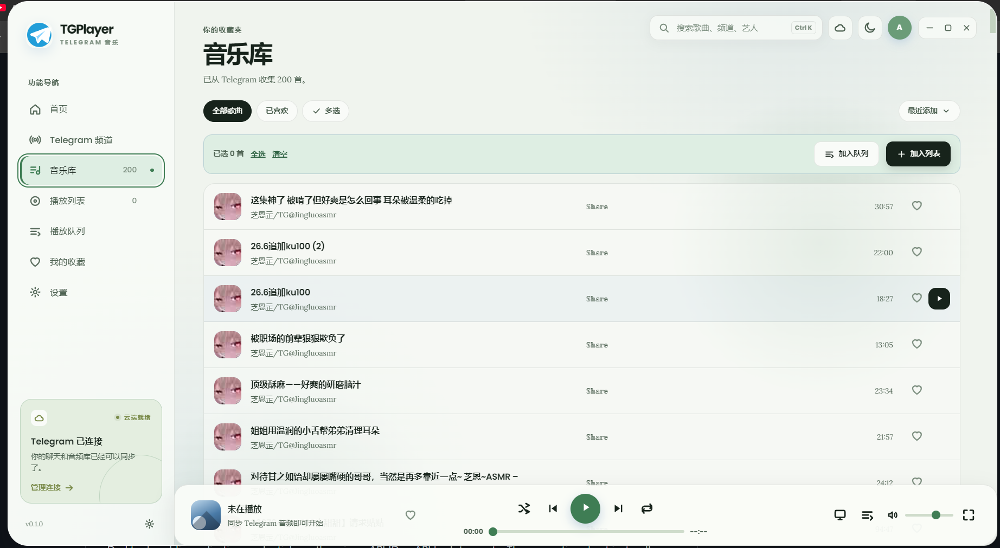

# TGPlayer

*[English](#english) · [中文](#中文)*

## English

TGPlayer is a Telegram-first desktop music player inspired by PixelPlayer's Material You palette, expressive motion and floating mini-player. It uses a light glass surface by default with a cool-blue Material You palette, a frameless rounded window with custom controls, and a Telegram paper-plane mark.

### Screenshots

| Home | Login confirmation |
| --- | --- |
|  |  |

| Settings | Music library |
| --- | --- |
|  |  |

### Run

```powershell
npm install
npm start
```

To create the Windows installer:

```powershell
npm run dist
```

The NSIS installer is written to `dist-final/TGPlayer-Setup-<version>.exe` (0.3.3 for the current build). Runtime session data and audio cache live in the app's per-user data directory (`%APPDATA%\tgplayer` on Windows). An existing `D:\TGPlayerData` folder from an earlier build is still used when it already holds data, so upgrades keep you signed in.

The first install downloads Electron. Network access is only needed for that install and for the GramJS Telegram bridge.

### Telegram connection

TGPlayer signs in with your **personal Telegram account**. You do **not** apply for anything: the app ships Telegram Desktop's public application credentials, so there is no API ID or API hash to create. The connection sheet just walks through:

`continue → phone number → verification code → optional two-step password → ready`

Because it uses public credentials this is not an official client, and Telegram may limit the account as a result. After authorization the Electron main process keeps an OS-encrypted StringSession in the app's user-data directory (it never leaves the machine) and exposes channel search and audio download through the isolated preload bridge. From the Channels page you pick which chats to scan, so TGPlayer only indexes audio from the chats you select rather than your whole account. Telegram audio messages are mapped to the same useful fields as PixelPlayer (`chat/channel`, `messageId`, title, artist, duration) and can be downloaded to the local app cache for playback.

Scanning pages a selected chat's **entire** audio history instead of only its newest messages, walking the audio-only server filter 100 messages per request. A long scan reports its progress in the sync button, and pressing that same button stops it; a stopped, flood-waited or interrupted scan keeps everything already indexed. The automatic sync on launch and reconnect is incremental — it asks only for audio newer than the stored index — while "Sync selected" performs a full re-index, which is what backfills history indexed by earlier versions.

Playback first asks the bridge for a loopback `127.0.0.1` stream URL. The small local HTTP server pulls Telegram media in chunks with GramJS `iterDownload`, so the renderer's audio element can begin playback before a full file is cached; a cached download is used as a fallback.

The player reopens where you left it: shuffle, repeat, volume and mute are stored with the other settings, and the last track is remembered by id along with its position and whether it was playing. A restore is retried as the library is adopted and as the session connects, rather than being attempted once — so a launch where the session is still signing in, or where the track is only indexed a moment later, still lands on your song instead of on the newest track. If a finished scan proves that track is no longer in the library, the app says so once and forgets it.

A bot is a content source, not a sign-in method: add a bot to a group or channel to post audio there, then sign in with your own account and select that chat on the Channels page to listen. Playing full-length tracks needs the personal-account login above, because the Bot API only exposes a short prefix of each file and cannot seek.

### PixelPlayer ideas carried over

- cool-blue Material You palette, light by default, with expressive tonal accents;
- asymmetric album-art hero, rounded Material cards and a persistent mini-player;
- emphasized `slide + fade + scale` page transitions and gentle floating artwork animation;
- queue, favorites, channel sync, search and playback controls;
- Telegram auth and song metadata are separated behind an IPC bridge, ready to be replaced by TDLib or a local range proxy if a native TDLib build is preferred.

---

## 中文

TGPlayer 是一款以 Telegram 为核心的桌面音乐播放器,借鉴了 PixelPlayer 的 Material You 配色、动效表现和悬浮迷你播放器。默认亮色玻璃质感界面,配冷蓝 Material You 色系,无边框圆角窗口 + 自定义控件,以及 Telegram 纸飞机标记。

### 界面示例

| 首页 | 登录确认 |
| --- | --- |
|  |  |

| 设置页 | 音乐库 |
| --- | --- |
|  |  |

### 运行

```powershell
npm install
npm start
```

生成 Windows 安装包:

```powershell
npm run dist
```

NSIS 安装包输出到 `dist-final/TGPlayer-Setup-<version>.exe`(当前构建是 0.3.3)。运行时的登录会话和音频缓存保存在应用的 per-user 数据目录(Windows 上是 `%APPDATA%\tgplayer`)。如果早期版本在 `D:\TGPlayerData` 已存有数据,会继续沿用,所以升级不会掉登录。

首次安装会下载 Electron。只有这次安装和 GramJS 的 Telegram 桥接需要联网。

### Telegram 连接

TGPlayer 用你的**个人 Telegram 账户**登录。你**不需要申请任何东西**:程序内置了 Telegram Desktop 的公开应用凭据,所以没有 API ID 或 API hash 要去申请。登录面板只是走一遍:

`继续 → 手机号 → 验证码 →(可选)两步验证密码 → 完成`

由于用的是公开凭据,这不是官方客户端,账号可能因此受到 Telegram 限制。授权后,登录会话(StringSession)经系统加密保存在应用的用户数据目录(绝不离开本机),并通过隔离的 preload bridge 提供频道搜索和音频下载。在「频道」页里**自己选**要扫描的聊天,TGPlayer 只索引选中聊天里的音频,不会读取你的整个账户。Telegram 音频消息被映射成和 PixelPlayer 一样的可用字段(`chat/channel`、`messageId`、标题、艺术家、时长),可以下载到本地缓存播放。

扫描会翻页索引选中聊天的**全部**音频历史,而不是只取最新的若干条(每页 100 条,走服务端的音频过滤器)。耗时较长的扫描会在同步按钮上显示进度,再次点击同一个按钮即可停止;被停止、被限流或中断的扫描不会丢掉已索引的内容。启动和重连时的自动同步是增量式的——只抓比本地索引更新的音频;而「同步所选」执行完整重扫,用它可以把旧版本只索引过最新 200 首的聊天补齐。

播放时先向桥接请求一个本地回环 `127.0.0.1` 的流地址。小型本地 HTTP 服务器用 GramJS 的 `iterDownload` 分块拉取 Telegram 媒体,所以渲染器的音频元素在整段文件缓存完之前就能开始播放;已缓存的下载作为兜底。

播放器会回到你上次离开的地方:随机、循环、音量和静音随其它设置一起保存,上次播放的曲目按 id 记住,连同播放位置和是否正在播放。恢复不再只尝试一次,而是在库被载入时、会话连上时重试——所以即使启动时会话还在登录、或那首曲子稍后才被索引出来,打开后仍会落在你的那首歌上,而不是最新一首。如果一次完整扫描确认这首已不在音乐库中,程序只提示一次并忘掉它。

机器人是**内容来源**,不是登录方式:把机器人加进某个群或频道让它发音频,然后**用你自己的账户登录**,在「频道」页选中那个群即可。完整播放(可拖动进度、读取完整时长)必须走上面的个人账户登录,因为 Bot API 只能拿到每个文件的前一小段、也不支持跳转。

### 从 PixelPlayer 借鉴的思路

- 冷蓝 Material You 色系,默认亮色,带富有表现力的色调点缀;
- 非对称的专辑封面主视觉、圆角 Material 卡片,以及常驻迷你播放器;
- 强调式的 `滑动 + 淡入 + 缩放` 页面转场,和轻柔的封面悬浮动画;
- 播放队列、收藏、频道同步、搜索和播放控制;
- Telegram 鉴权与歌曲元数据隔离在 IPC 桥接之后,如果更倾向原生 TDLib 构建,可替换为 TDLib 或本地 range 代理。
